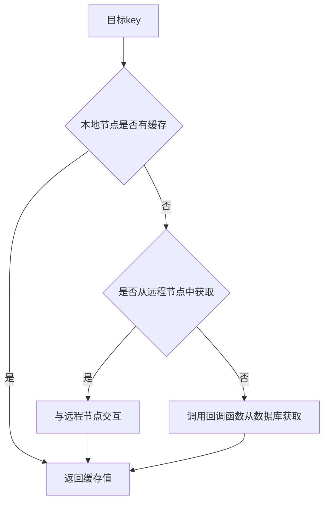
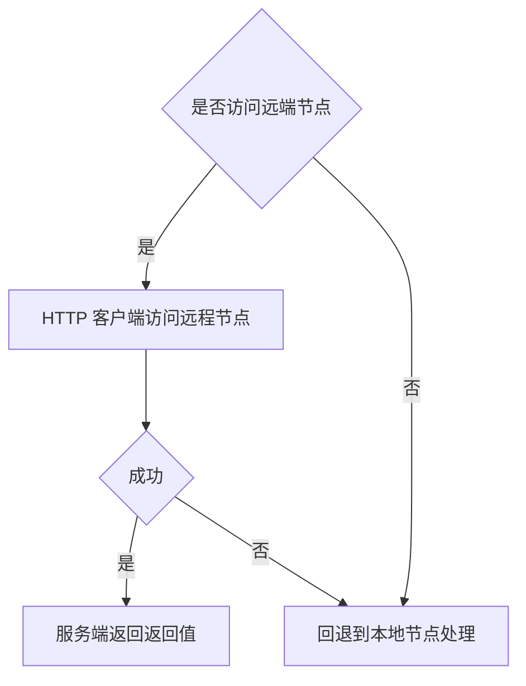

## 系统结构


##  1 LRU 缓存淘汰策略
Map+双向链表：
每操作一次节点，就将节点移到队尾
内存超了 就删掉队首节

实现： 结构体， get函数，removeoldest函数，新增修改函数
 
问题：如果对于需要周期处理的数据 ？

优化解决： 
 
拓展：带定时器的LRU

## 2 并发缓存
要点：Mutex 互斥锁 实现LRU的并发控制
数据结构Group 

### 2.1 Byteview类 作为value
1. 用[]byte数组作为value(可以存储各种类型) 并实现克隆方法 读时返回克隆值
2. 实现方法：Len()  ByteSlice()  cloneBytes() String()

知识点：深拷贝浅拷贝 浅：不拷贝对象里引用的对象 

### 2.2 给lru添加并发特性
实例化lru 封装add和get方法 在两个方法调用时加锁
多个goroutine读写同一个变量时，用Lock()和unLock()对可能发生冲突的代码段进行保护
为lru中cache添加并发特性
1. 只读时返回原value的拷贝值，原value用byte数组表示，因为可以支持任意的数据类型
2. 实例化lru，在get和add中加入mutex互斥锁 

### 2.3 实现Group结构 
#### 2.3.1 回调Getter
如果缓存不存在 通过回调函数获取源数据并添加到缓存中 
实现：
 1. getter接口
 2. 函数类型GetterFunc 实现Get
  接口型函数 : 可以传入函数作为参数 也能传入实现该接口的结构体作为参数

#### 2.3.2 Group定义：缓存命名空间 
结构：name getter mainCache
实现构造函数 和 getgroup函数

#### 2.3.3 重要方法 get
缓存中有则返回
缓存中无 则调用load方法 去调用用户的回调函数 并将源数据添加至缓存mainCache中

## 3  HTTP服务器
### 3.1 http库
- 创建任意类型 server，并实现 ServeHTTP 方法。
- 调用 http.ListenAndServe 在port 端口启动 http 服务，处理请求的对象为 server

```java
package main

import (
	"log"
	"net/http"
)

type server int

func (h *server) ServeHTTP(w http.ResponseWriter, r *http.Request) {
	log.Println(r.URL.Path)
	w.Write([]byte("Hello World!"))
}

func main() {
	var s server
	http.ListenAndServe("localhost:9999", &s)
}
```
### 3.2 创建GeeCache HTTP服务端
- 定义节点
服务器IP端口号 节点访问前缀basePath
- 实现server方法
     1. 判断访问是否合法
     2. 获取groupName和key
     3. 调用getgroup函数读取group
     4. group.get(key)获取对应缓存
     5. 将缓存值写入httpResponse的body返回

## 4 分布式多节点实现

### 4.1 一致性哈希


分布式缓存会将不同的数据缓存进不同的节点，通过一致性hash让每次key请求都能发送到缓存key的对应节点

- 方案一： hash算法 hash(key)%10 任意一个客户端请求key 都会发送到固定的节点

问题：节点数量发生变化怎么处理？移除一台节点，缓存值对应节点都发生了变化。所有缓存失效，需要重新去获取数据，引起缓存雪崩

- 方案二：一致性哈希算法
    算法步骤：
    1. 计算节点的哈希值 放在环上
    2. 计算key的hash，放在环上，顺时针寻到第一个节点就是应该选取的节
    3. 在新加入节点时，只需要重新定位一小部分数据即可
  问题：数据倾斜 缓存节点间负载不均
  解决：利用虚拟节点，扩充了节点数量 一个真实节点可以对应多个虚拟节点
    1. 计算虚拟节点的hash值，放在环上
    2. 计算key的hash值找到对应的虚拟节点

思考：hash算法的选择？TODO
  
### 4.2 多节点实现
1. 定义hash函数计算hash值
2. 定义数据结构Map，保存hash函数，虚拟节点倍数，哈希环keys(虚拟节点hash值)，虚拟节点与真实节点映射map
3. New()函数构造数据结构
4. 添加真实节点的Add方法
5. 根据key值选择真实节点的get方法
6. TODO: 删除节点操作
  
## 5 实现客户端

- 客户端获取key的value流程: 

- 从远端节点获取缓存值

### 5.1 选择节点

- 抽象接口：
   1. 根据传入的key值选择响应节点接口PeerPicker
   2. HTTP客户端实现get方法，从group中查找缓存值

- 实现HTTP客户端
- 添加节点选择功能
- 实现PeerPicker接口
- 集成到geecache中

### 测试


## 6 缓存雪崩和缓存击穿

- 缓存雪崩：缓存在同一时间失效，造成DB瞬间请求压力大；可能原因：同时过期 或者缓存服务器宕机
- 缓存击穿：一个热点key突然失效，导致大量请求打到DB上
- 缓存穿透：反复查询不存在的数据，缓存里没有，只能去DB，瞬间流量大导致DB宕机

**问题**
8003节点收到同一个key的N个请求，并向远端8001节点请求N次
造成资源浪费，也有可能造成缓存击穿和缓存穿透

**解决** singleflight
并发场景下如果 Cache已经向其他节点/源获取数据了，那么就加锁阻塞其他相同的请求，等待请求结果，防止其他节点/源压力猛增被击穿。

1. 用map维护一个不同key的对应的call
2. call中利用sync.WaitGroup函数来保证同个key不会并发的发起多个请求 但是串行时同个key还是会发起多个请求的 
3. 发起请求前 wg.add(1) 请求结束时 wg.done 
4. 如果此时同时有别的请求 调用wg.Wait() 阻塞等待请求结果，然后返回
5. call的数据结构为：{sync.WaitGroup,interface{}值的接口,error错误}
6. 请求结束后删除此 key

**在项目中使用**
- 将*singleflight.Group放入group结构中
- 重写load方法

- 为什么删除key？
   1. 不删除，如果key对应的值变化，所得的值还是旧值
   2. 占用内存

- map加锁目的：保护其不被并发写map[key]call，map中存在key之后就解锁，wait等待第一个协程返回结果，保证wg.Add(1)只执行一次

其他问题：
1. 容错 这次call失败了怎么办？
2. 是否能用sync.Once代替sync.WaitGroup？

## 7 优化节点间通信

1. 什么是protobuf？
protobuf是一种结构数据序列化的方法，类比于XML
> 将结构数据或对象转换成能够被存储和传输（例如网络传输）的格式，同时应当要保证这个序列化结果在之后（可能在另一个计算环境中）能够被重建回原来的结构数据或对象。

2. 为什么使用protobuf？
- 在传输前用protobuf编码，接收方进行解码 在网络传输过程中显著降低二进制传输的大小
- protobuf具有扩展性，便于通信字段的扩展

3. 如何使用protobuf？
- 在.proto文件中定义数据结构 用protoc生成Go代码
1. [安装protoc](https://github.com/protocolbuffers/protobuf/releases)
bin目录添加到环境变量
2. 安装protoc-gen-go
```
# 设置全局代理：
go env -w GOPROXY=https://goproxy.cn,direct
go get -u github.com/golang/protobuf/protoc-gen-go@v1.3.2
```
- 在项目中引用生成的Go代码
    1. 定义request和response的数据结构proto格式
    2. 生成go文件
    3. 修改peers里peergetter接口 req和resp都改用protobuf形式序列化
    4. 重写httpclient的get函数 对接受的resp进行反序列化

问题：
为什么protobuf高效？
和JsonXML比优点在哪儿？
在gRPC中可以使用proto buffer作为其接口定义语言 (IDL) 和底层消息交换格式。
gRPC是什么？


## 问题&解决记录
1. go mod对go的package进行管,
go mod init会将当前工作目录作为项目根目录 


2. go test编译报错

command-line-arguments [command-line-arguments.test]

原因：找不到依赖文件
解决：go test -v xxx.go xxx_test.go
